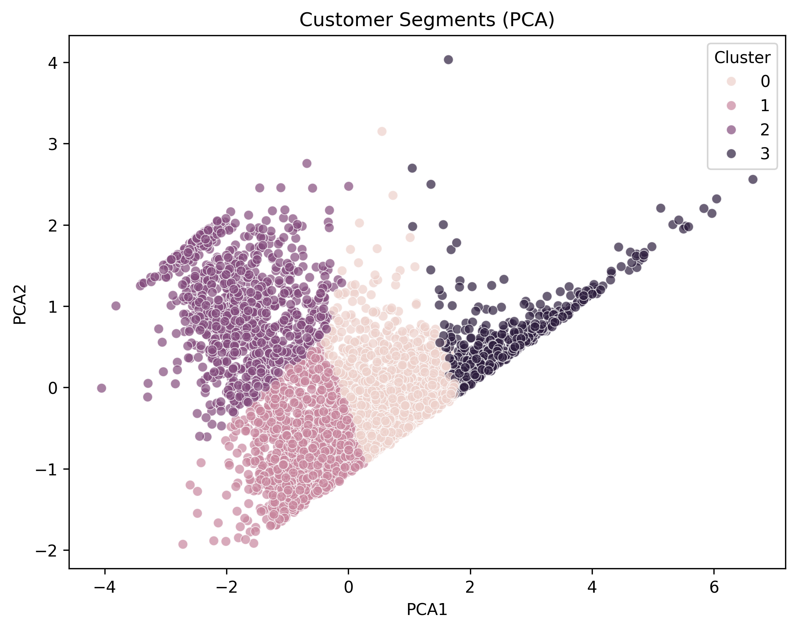
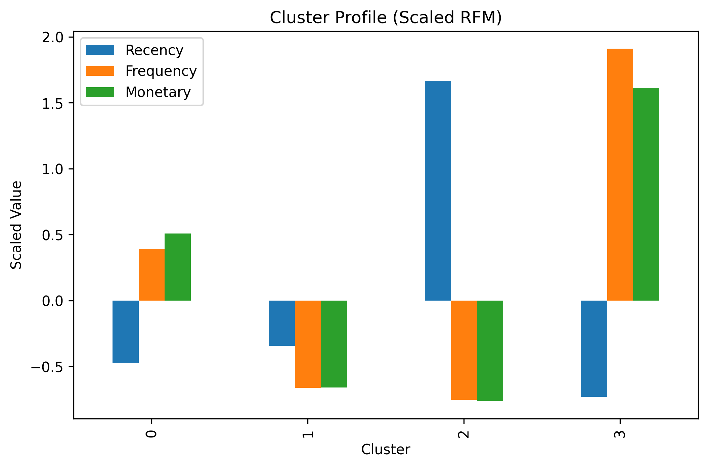

# E-commerce Customer Segmentation

Online Retail Dataset을 활용하여 전자상거래 고객의 구매 행동을 분석하고 RFM 분석과 K-means 클러스터링을 통해 고객 세분화를 수행한 데이터 분석 프로젝트입니다.

---

## 1. Project Objective

본 프로젝트는 전자상거래 거래 데이터를 기반으로 고객의 구매 행동 패턴을 분석하고 RFM(Recency, Frequency, Monetary) 지표를 활용하여 고객 세그먼트를 도출하는 것을 목표로 합니다.

이를 위해

- 거래 데이터 전처리
- 고객 단위 RFM 변수 생성
- K-means 클러스터링을 통한 고객 세분화
- PCA 기반 시각화 및 세그먼트 해석

을 수행하였습니다.

고객 세분화를 통해 고객 행동 패턴을 이해하고, 각 고객 그룹의 특징을 데이터 기반으로 분석하였습니다.

---

## 2. Dataset

- Source: UCI Machine Learning Repository - Online Retail Dataset  
    - https://archive.ics.uci.edu/ml/datasets/online+retail

- Platform: UK-based online retail store
- Time Period: Dec 2010 – Dec 2011
- Transactions: 541,909
- Customers (after preprocessing): 4,339

### 주요 변수

- InvoiceNo : 주문 번호
- StockCode : 상품 코드
- Description : 상품 설명
- Quantity : 구매 수량
- InvoiceDate : 주문 날짜
- UnitPrice : 상품 가격
- CustomerID : 고객 ID
- Country : 국가

---

## 3. Methodology

1. 데이터 전처리
   - CustomerID 결측치 제거
   - 취소 주문 제거
   - Quantity / UnitPrice 이상값 제거

2. Feature Engineering
   - 고객 단위 RFM 변수 생성
   - Recency / Frequency / Monetary 계산
   - 로그 변환을 통한 분포 왜곡 완화

3. Clustering
   - Feature Scaling (StandardScaler)
   - Elbow Method를 통한 클러스터 후보 탐색
   - Silhouette Score 기반 클러스터 품질 평가
   - K-means 클러스터링 수행 (k = 4)

4. Visualization & Interpretation
   - PCA 기반 클러스터 시각화
   - Cluster Profile 분석
   - 고객 세그먼트 해석

---

## 4. Customer Segments

클러스터 분석 결과 고객은 다음과 같은 네 가지 그룹으로 구분되었습니다.

| Cluster | Segment | Description |
|-------|-------|-------------|
| 3 | VIP Customers | 최근 구매, 높은 구매 빈도, 높은 구매 금액을 보이는 핵심 고객 |
| 0 | Loyal Customers | 안정적인 구매 패턴을 보이는 충성 고객 |
| 1 | Occasional Customers | 구매 빈도와 금액이 낮은 일반 고객 |
| 2 | At-Risk Customers | 오랫동안 구매하지 않은 이탈 위험 고객 |

---

## 5. Key Findings

- 일부 고객 그룹(VIP Customers)이 높은 구매 빈도와 구매 금액을 보이며 핵심 매출을 담당한다.
- 전체 고객 중 상당수는 낮은 구매 빈도를 보이는 일반 고객군에 속한다.
- 오랫동안 구매하지 않은 고객 그룹이 존재하며, 재활성화 전략이 필요하다.
- RFM 기반 고객 세분화는 고객 행동 패턴을 이해하는 데 효과적인 방법임을 확인하였다.

---

## 6. Limitations

본 분석은 고객 구매 행동 패턴을 기반으로 한 **비지도 학습 기반 세분화 분석**이며, 각 세그먼트가 실제 비즈니스 전략에서 어떻게 활용되는지는 추가적인 비즈니스 맥락이 필요합니다.

또한 본 데이터는 단일 전자상거래 플랫폼의 거래 데이터를 기반으로 하므로 다른 산업이나 플랫폼에 동일하게 적용되기에는 한계가 있을 수 있습니다.

---

## 7. Repository Structure

```
ecommerce-customer-segmentation
│
├── data/                  # (raw / processed는 Git에 포함되지 않음)
│
├── figures/               # 분석 결과 시각화
│   ├── cluster_pca.png
│   └── cluster_profile.png
│
├── notebooks/
│   ├── 01_data_preprocessing.ipynb
│   └── 02_customer_clustering.ipynb
│
├── .gitignore
├── README.md
└── requirements.txt
```

※ data/raw/, data/processed/ 디렉토리는 대용량 파일 및 보안 이슈로 Git에 포함하지 않았습니다.

---

## 8. Cluster Visualization





---

## 9. Author

Personal Data Analysis Project  
2026